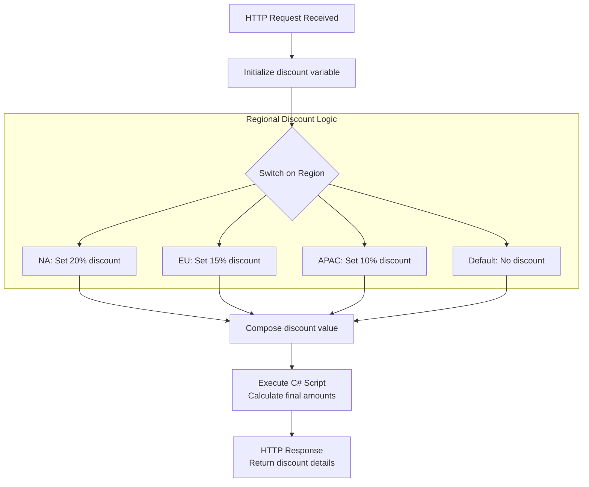
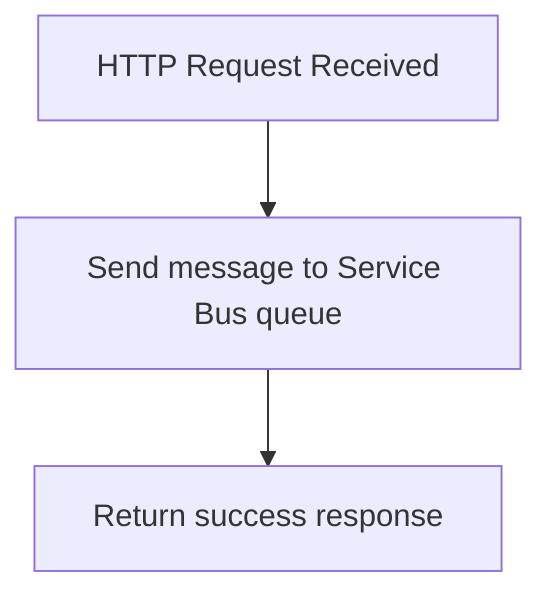
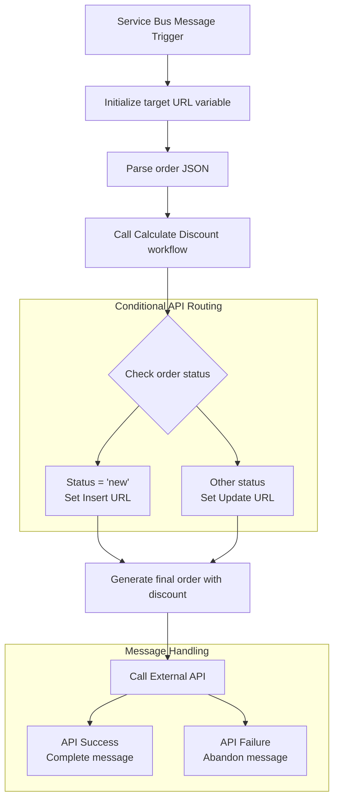

# UnitTest Dynamic CallBack

This Azure Logic Apps Standard project demonstrates a complete order processing system with dynamic discount calculation and external API integration. The solution showcases unit testing capabilities for Logic Apps workflows, featuring Service Bus message processing, regional discount calculations, and external system callbacks.

## Overview

The project implements an order processing pipeline that:
- Receives order requests via HTTP endpoints
- Applies regional discount calculations (NA: 20%, EU: 15%, APAC: 10%)
- Processes orders asynchronously through Azure Service Bus
- Integrates with external APIs for order persistence
- Demonstrates unit testing patterns for Logic Apps workflows

This solution is ideal for demonstrating integration patterns, message-driven architectures, and testing strategies for enterprise Logic Apps implementations.

## Prerequisites

The following Azure services are required for this project:

- **Azure Service Bus** - Message queuing and asynchronous order processing
- **External API Endpoints** - For order insertion and update operations (configured via parameters)

## Deployment Instructions

Deploy this Logic Apps Standard project using Visual Studio Code:

1. Install the Azure Logic Apps (Standard) extension in VS Code
2. Configure your Azure subscription and resource group
3. Right-click on the LogicApps folder and select "Deploy to Logic App"
4. Follow the deployment wizard to create or select your Logic App resource
5. Configure the required connections and parameters after deployment

## Workflows

### la-calculate-discount

Calculates discount amounts based on customer region and order details using embedded C# script execution.

#### Process Flow

#### Required Connections

This workflow uses embedded C# script execution and does not require external connections.

### la-receive-order

Receives order requests via HTTP and forwards them to Azure Service Bus for asynchronous processing.

#### Process Flow

#### Required Connections

|Connection Name|Connector Name|Connector Type|
|---|---|---|
|servicebus-conn-test|Service Bus|Service Provider|

### la-sb-process-order

Processes orders from Service Bus queue, calculates discounts, and integrates with external APIs based on order status.

#### Process Flow

#### Required Connections

|Connection Name|Connector Name|Connector Type|
|---|---|---|
|servicebus-conn-test|Service Bus|Service Provider|
